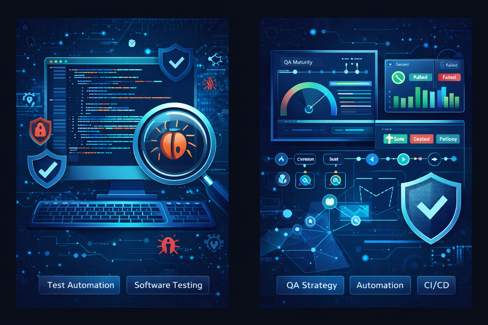

# 👋 Olá, eu sou Ivaneide

### QA Analyst • Test Automation • Quality Engineering

---

### 🔎 Foco Profissional

---

# 📊 GitHub Metrics

---

### 🚀 Projetos em Destaque

---

<table>
<tr>

<td align="center" valign="middle">

</td>

<td align="center" valign="middle">

## 💡 Minha atuação envolve

✔ identificação de falhas funcionais  
✔ análise de qualidade de software  
✔ melhoria da experiência do usuário  
✔ criação de estratégias de testes  
✔ automação de testes  
✔ investigação de bugs e análise de causa raiz  

</td>

<td align="center" valign="middle">

</td>

</tr>
</table>

---

# 🧠 Tecnologias e Ferramentas

### 🧪 Test Automation

---

### ⚙️ DevOps

---

### 💻 Programming

---

# 🚀 Projetos de QA

Aqui estão alguns projetos que demonstram minha experiência prática em **Software Quality Assurance, Test Automation e Engenharia de Qualidade**.

---

## 🐞 QA Bug Hunt – DemoQA

Projeto de **testes exploratórios e documentação de bugs**.

📂 Repositório

---

## 🤖 Automação de Testes – Plataforma APRBS

Projeto de **automação de testes E2E com Cypress** integrado ao **GitHub Actions**.

📂 Repositório

---

## 🔎 QA Software Quality Diagnosis

Ferramenta de análise de **maturidade de qualidade em sistemas**.

📂 Repositório

---

## 📘 QA Engineering Roadmap

Organização dos meus estudos em **Quality Engineering**.

📂 Repositório

---

## 🗄️ QA SQL Testing Lab

Projeto focado em **validação de dados e investigação de bugs utilizando SQL**.

Inclui:

✔ SQL validations  
✔ bug investigation  
✔ test cases  
✔ root cause analysis  
✔ QA case study  

📂 Repositório

---

## 🔄 Dev-QA Sync Playbook

Projeto que demonstra um **workflow completo de colaboração entre desenvolvimento e QA**, utilizando GitHub como ambiente de gestão de qualidade.

Inclui:

✔ QA workflow documentation  
✔ bug reporting structure  
✔ test case organization  
✔ Dev–QA collaboration model  
✔ quality engineering documentation  

📂 Repositório

# 🔥 Gráfico de Contribuição

---

# 📬 Contato

⭐ Este perfil apresenta meus **projetos e estudos em Software Quality Assurance e Test Automation**.